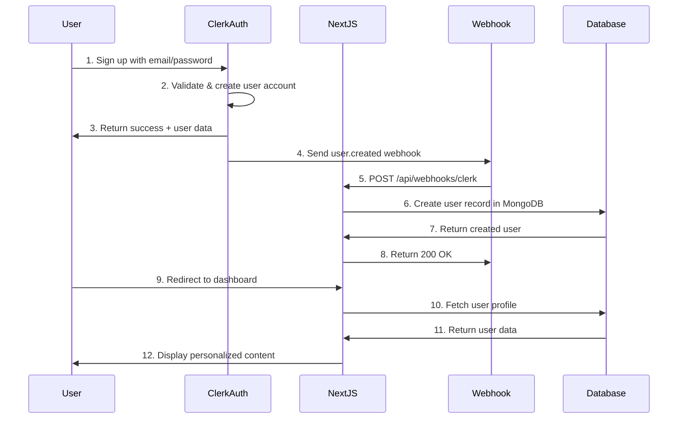

# SareeShop - System Architecture & Use Cases

## Table of Contents
1. [System Architecture Overview](#system-architecture-overview)
2. [User Registration & Authentication Flow](#user-registration--authentication-flow)
3. [Database Architecture](#database-architecture)
4. [Use Cases](#use-cases)
5. [API Architecture](#api-architecture)
6. [Frontend Architecture](#frontend-architecture)
7. [Security Architecture](#security-architecture)
8. [Deployment Architecture](#deployment-architecture)

## System Architecture Overview

```
┌─────────────────┐    ┌─────────────────┐    ┌─────────────────┐
│   Frontend      │    │   Backend       │    │   Database      │
│   (Next.js 14)  │    │   (API Routes)  │    │   (MongoDB)     │
│                 │    │                 │    │                 │
│ - Pages         │◄──►│ - Authentication│◄──►│ - Users         │
│ - Components    │    │ - Product APIs  │    │ - Products      │
│ - State Mgmt    │    │ - Order APIs    │    │ - Orders        │
│ - UI/UX         │    │ - Cart APIs     │    │ - Categories    │
└─────────────────┘    └─────────────────┘    └─────────────────┘
         │                       │                       │
         ▼                       ▼                       ▼
┌─────────────────┐    ┌─────────────────┐    ┌─────────────────┐
│   External      │    │   Middleware    │    │   File Storage  │
│   Services      │    │                 │    │                 │
│                 │    │ - Auth Check    │    │ - Product Images│
│ - Clerk Auth    │    │ - Rate Limiting │    │ - User Avatars  │
│ - Payment Gway  │    │ - CORS          │    │ - Documents     │
│ - Email Service │    │ - Validation    │    │                 │
└─────────────────┘    └─────────────────┘    └─────────────────┘
```

## User Registration & Authentication Flow

### Sign-Up Process with Database Integration



### User Data Flow
1. **Clerk Registration**: User signs up through Clerk authentication
2. **Webhook Trigger**: Clerk sends `user.created` webhook to `/api/webhooks/clerk`
3. **Database Sync**: Webhook handler creates user record in MongoDB with:
   - `clerkId`: Unique Clerk user identifier
   - `email`: User's email address
   - `name`: User's display name
   - `role`: Default USER role
   - `createdAt`: Timestamp
4. **Profile Setup**: User can update additional profile information
5. **Cart/Wishlist**: Empty cart and wishlist are created for the user

## Database Architecture

### Entity Relationship Diagram

```
┌─────────────┐     ┌─────────────┐     ┌─────────────┐
│    User     │────▶│   Address   │     │  Category   │
│             │     │             │     │             │
│ - clerkId   │     │ - name      │     │ - name      │
│ - email     │     │ - phone     │     │ - slug      │
│ - name      │     │ - address1  │     │ - parentId  │
│ - role      │     │ - city      │     │ - isActive  │
└─────────────┘     └─────────────┘     └─────────────┘
        │                   │                   │
        ▼                   ▼                   ▼
┌─────────────┐     ┌─────────────┐     ┌─────────────┐
│    Cart     │     │    Order    │     │   Product   │
│             │◄────│             │────▶│             │
│ - userId    │     │ - orderNo   │     │ - name      │
│ - items[]   │     │ - status    │     │ - sku       │
└─────────────┘     │ - total     │     │ - price     │
        │           └─────────────┘     │ - stock     │
        ▼                   │           │ - categoryId│
┌─────────────┐             ▼           └─────────────┘
│  CartItem   │     ┌─────────────┐             │
│             │     │  OrderItem  │             ▼
│ - productId │     │             │     ┌─────────────┐
│ - quantity  │     │ - productId │     │   Review    │
│ - price     │     │ - quantity  │     │             │
└─────────────┘     │ - price     │     │ - rating    │
                    └─────────────┘     │ - comment   │
                                        └─────────────┘
```

## Use Cases

### 1. Customer Use Cases

#### 1.1 User Registration & Authentication
- **Primary Actor**: New Customer
- **Goal**: Create account and access platform
- **Preconditions**: User has valid email
- **Flow**:
  1. User clicks "Sign Up"
  2. User enters email, password, name
  3. Clerk validates and creates account
  4. Webhook creates user record in database
  5. User receives welcome email
  6. User can access platform features

#### 1.2 Product Browsing & Search
- **Primary Actor**: Customer
- **Goal**: Find desired saree products
- **Flow**:
  1. User visits homepage
  2. User browses categories (Silk, Cotton, Designer, etc.)
  3. User applies filters (price, color, fabric, occasion)
  4. User searches by keywords
  5. System displays filtered results
  6. User views product details

#### 1.3 Shopping Cart Management
- **Primary Actor**: Authenticated Customer
- **Goal**: Manage items for purchase
- **Flow**:
  1. User adds product to cart
  2. System updates cart in database
  3. User views cart items
  4. User modifies quantities or removes items
  5. System calculates totals
  6. User proceeds to checkout

#### 1.4 Order Placement
- **Primary Actor**: Authenticated Customer
- **Goal**: Complete purchase
- **Preconditions**: Items in cart, valid address
- **Flow**:
  1. User reviews cart items
  2. User selects/adds shipping address
  3. User chooses payment method
  4. User confirms order
  5. System processes payment
  6. System creates order record
  7. System sends order confirmation
  8. System updates inventory

#### 1.5 Order Tracking
- **Primary Actor**: Customer with orders
- **Goal**: Track order status
- **Flow**:
  1. User accesses order history
  2. User selects specific order
  3. System displays order details and status
  4. User views tracking information
  5. User receives status update notifications

#### 1.6 Wishlist Management
- **Primary Actor**: Authenticated Customer
- **Goal**: Save products for later
- **Flow**:
  1. User adds product to wishlist
  2. System saves to user's wishlist
  3. User views wishlist items
  4. User moves items to cart
  5. User removes items from wishlist

#### 1.7 Product Reviews
- **Primary Actor**: Customer with completed orders
- **Goal**: Rate and review purchased products
- **Flow**:
  1. User accesses order history
  2. User selects delivered order
  3. User rates product (1-5 stars)
  4. User writes review text
  5. User uploads images (optional)
  6. System saves review
  7. Review appears on product page

### 2. Admin Use Cases

#### 2.1 Admin Authentication
- **Primary Actor**: Admin User
- **Goal**: Access admin dashboard
- **Preconditions**: User has ADMIN or SUPER_ADMIN role
- **Flow**:
  1. Admin logs in through Clerk
  2. System verifies admin role
  3. Admin accesses dashboard
  4. Admin views analytics overview

#### 2.2 Product Management
- **Primary Actor**: Admin
- **Goal**: Manage product catalog
- **Flow**:
  1. Admin accesses product management
  2. Admin creates new product
  3. Admin sets product details (name, price, category)
  4. Admin uploads product images
  5. Admin sets variants (colors, sizes)
  6. Admin configures inventory
  7. Admin publishes product

#### 2.3 Category Management
- **Primary Actor**: Admin
- **Goal**: Organize product categories
- **Flow**:
  1. Admin accesses category management
  2. Admin creates/edits categories
  3. Admin sets category hierarchy
  4. Admin uploads category images
  5. Admin activates/deactivates categories

#### 2.4 Order Management
- **Primary Actor**: Admin
- **Goal**: Process customer orders
- **Flow**:
  1. Admin views order queue
  2. Admin processes pending orders
  3. Admin updates order status
  4. Admin assigns tracking numbers
  5. Admin handles returns/refunds

#### 2.5 User Management
- **Primary Actor**: Super Admin
- **Goal**: Manage user accounts and roles
- **Flow**:
  1. Super Admin accesses user management
  2. Super Admin views user list
  3. Super Admin updates user roles
  4. Super Admin deactivates accounts if needed

#### 2.6 Analytics & Reporting
- **Primary Actor**: Admin
- **Goal**: Monitor business performance
- **Flow**:
  1. Admin accesses analytics dashboard
  2. Admin views sales reports
  3. Admin analyzes customer behavior
  4. Admin tracks inventory levels
  5. Admin generates custom reports

### 3. System Use Cases

#### 3.1 Inventory Management
- **Primary Actor**: System
- **Goal**: Maintain accurate stock levels
- **Flow**:
  1. System monitors product stock
  2. System decrements stock on order
  3. System sends low stock alerts
  4. System prevents overselling
  5. System updates availability status

#### 3.2 Payment Processing
- **Primary Actor**: Payment Gateway
- **Goal**: Process customer payments
- **Flow**:
  1. System initiates payment request
  2. Payment gateway processes payment
  3. System receives payment confirmation
  4. System updates order status
  5. System sends payment receipt

#### 3.3 Email Notifications
- **Primary Actor**: Email Service
- **Goal**: Send transactional emails
- **Flow**:
  1. System triggers email event
  2. Email service sends notification
  3. Customer receives email
  4. System logs email delivery

## API Architecture

### RESTful API Endpoints

```
Authentication (handled by Clerk + Webhooks)
POST /api/webhooks/clerk          # Sync user data from Clerk

Users
GET /api/users/profile           # Get current user profile
PUT /api/users/profile           # Update user profile
GET /api/users/addresses         # Get user addresses
POST /api/users/addresses        # Add new address

Products
GET /api/products               # List products with filters
GET /api/products/[id]          # Get product details
POST /api/products              # Create product (admin)
PUT /api/products/[id]          # Update product (admin)
DELETE /api/products/[id]       # Delete product (admin)

Categories
GET /api/categories             # List all categories
GET /api/categories/[slug]      # Get category details
POST /api/categories            # Create category (admin)

Cart
GET /api/cart                   # Get user cart
POST /api/cart/add              # Add item to cart
PUT /api/cart/update            # Update cart item
DELETE /api/cart/remove         # Remove cart item

Orders
GET /api/orders                 # Get user orders
POST /api/orders                # Create new order
GET /api/orders/[id]            # Get order details
PUT /api/orders/[id]/status     # Update order status (admin)

Reviews
GET /api/products/[id]/reviews  # Get product reviews
POST /api/reviews               # Create review
PUT /api/reviews/[id]           # Update review
DELETE /api/reviews/[id]        # Delete review
```

## Frontend Architecture

### Component Structure
```
components/
├── layout/
│   ├── Header.tsx              # Navigation, search, cart icon
│   ├── Footer.tsx              # Links, contact info
│   └── Sidebar.tsx             # Mobile navigation
├── home/
│   ├── HeroSection.tsx         # Banner with featured products
│   ├── CategoryGrid.tsx        # Category navigation
│   ├── FeaturedProducts.tsx    # Featured product carousel
│   └── Newsletter.tsx          # Email subscription
├── products/
│   ├── ProductCard.tsx         # Product listing item
│   ├── ProductGrid.tsx         # Product listing layout
│   ├── ProductDetails.tsx      # Product detail page
│   ├── ProductGallery.tsx      # Product image gallery
│   └── ProductFilters.tsx      # Search and filter controls
├── cart/
│   ├── CartDrawer.tsx          # Slide-out cart
│   ├── CartItem.tsx            # Individual cart item
│   └── CartSummary.tsx         # Order total and checkout
├── auth/
│   ├── SignInForm.tsx          # Sign-in form (Clerk)
│   └── SignUpForm.tsx          # Sign-up form (Clerk)
└── ui/
    ├── Button.tsx              # Reusable button component
    ├── Input.tsx               # Form input component
    ├── Modal.tsx               # Modal dialog
    └── Toast.tsx               # Notification component
```

### State Management
- **TanStack Query**: Server state management and caching
- **React Context**: User authentication state
- **Local State**: Component-specific state (React hooks)
- **Clerk**: Authentication state management

## Security Architecture

### Authentication & Authorization
1. **Clerk Integration**: Handles all authentication flows
2. **JWT Tokens**: Secure API communication
3. **Role-Based Access**: USER, ADMIN, SUPER_ADMIN roles
4. **Middleware Protection**: Route-level authentication
5. **API Validation**: Input sanitization and validation

### Data Security
1. **Environment Variables**: Sensitive data in env files
2. **Database Security**: MongoDB connection with authentication
3. **HTTPS**: Encrypted data transmission
4. **Input Validation**: Prevent injection attacks
5. **Rate Limiting**: API abuse prevention

## Deployment Architecture

### Production Stack
```
┌─────────────────┐
│   CDN (Vercel)  │  # Static assets and images
└─────────────────┘
         │
┌─────────────────┐
│   Frontend      │  # Next.js app on Vercel
│   (Vercel)      │
└─────────────────┘
         │
┌─────────────────┐
│   API Routes    │  # Serverless functions
│   (Vercel)      │
└─────────────────┘
         │
┌─────────────────┐
│   Database      │  # MongoDB Atlas
│   (MongoDB)     │
└─────────────────┘
```

### CI/CD Pipeline
1. **Git Push**: Code pushed to repository
2. **Vercel Build**: Automatic build trigger
3. **Type Check**: TypeScript compilation
4. **Lint Check**: ESLint validation
5. **Build**: Next.js production build
6. **Deploy**: Automatic deployment to Vercel
7. **Database**: Prisma migrations applied

### Environment Configuration
- **Development**: Local MongoDB, development Clerk keys
- **Staging**: Staging database, staging Clerk environment
- **Production**: Production MongoDB Atlas, production Clerk keys

## Performance Considerations

### Frontend Optimization
- **Image Optimization**: Next.js Image component
- **Code Splitting**: Dynamic imports for large components
- **Caching**: Browser caching for static assets
- **Lazy Loading**: Product images and components
- **Bundle Analysis**: Regular bundle size monitoring

### Backend Optimization
- **Database Indexing**: Optimized queries with proper indexes
- **Caching**: Query result caching with React Query
- **Compression**: Gzip compression for API responses
- **CDN**: Static asset delivery via CDN

### Database Optimization
- **Indexes**: Strategic indexing on frequently queried fields
- **Aggregation**: Efficient data aggregation for analytics
- **Connection Pooling**: Optimized database connections
- **Data Modeling**: Efficient document structure for MongoDB

## Monitoring & Analytics

### Application Monitoring
- **Error Tracking**: Error logging and alerting
- **Performance Monitoring**: Page load times and API response times
- **User Analytics**: User behavior and conversion tracking
- **Uptime Monitoring**: Service availability monitoring

### Business Analytics
- **Sales Metrics**: Revenue, conversion rates, average order value
- **Product Analytics**: Popular products, category performance
- **Customer Insights**: User engagement and retention
- **Inventory Analytics**: Stock levels and turnover rates